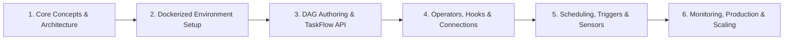

# Apache Airflow Study Curriculum & Hands-on Lab

This directory contains learning materials, conceptual notes, Docker deployment scripts, and project workflows for **Apache Airflow** — the industry standard for workflow orchestration and data pipeline automation.

---

## 📚 Curriculum Roadmap

### Module 1: Core Concepts & Architecture
* **What is Airflow?**: Open-source workflow orchestration written purely in Python.
* **The DAG Model**: Directed Acyclic Graphs, avoiding circular dependencies, dynamic generation.
* **Core Components**:
  * **Webserver**: UI dashboard to inspect DAG runs, logs, and metadata.
  * **Scheduler**: Monitors task states, triggers scheduled DAGs, and queues tasks.
  * **Executor**: Allocates tasks to workers (`SequentialExecutor`, `LocalExecutor`, `CeleryExecutor`, `KubernetesExecutor`).
  * **Worker**: Process/node executing the task payload.
  * **Metadata Database**: PostgreSQL/MySQL storing execution states, variables, and connection credentials.
  * **Triggerer**: Handles deferred asynchronous tasks efficiently.

### Module 2: Containerized Airflow Deployment (Docker)
* Setting up multi-container Airflow stacks with `docker-compose.yaml`.
* Configuring volume mounts (`./dags`, `./logs`, `./plugins`, `./config`).
* Managing permissions with `AIRFLOW_UID` and environment configurations.
* Injecting dynamic Python dependencies via `_PIP_ADDITIONAL_REQUIREMENTS`.

### Module 3: DAG Development & Operators
* **Classic Operators**: `BashOperator`, `PythonOperator`, `SQLExecuteQueryOperator`, `EmailOperator`.
* **TaskFlow API**: Decorator-driven DAGs (`@dag`, `@task`) with automated XCom parameter passing.
* **Dependency Patterns**:
  * Linear: `task1 >> task2 >> task3`
  * Branching: `BranchPythonOperator` or `@task.branch`
  * Dynamic Task Mapping: Mapping tasks over dynamic runtime lists.

### Module 4: Advanced Concepts & Production Engineering
* **Data Intervals & Logical Dates**: Understanding `data_interval_start` vs. `data_interval_end`.
* **Resource Management**: Concurrency control via **Pools**, **Slots**, and **Priority Weights**.
* **Integrations**: Writing custom Hooks and managing encrypted Connections.
* **SLA & Alerting**: Handling retries (`retries`, `retry_delay`), callbacks (`on_failure_callback`), and notifications.

---

## 📂 Repository Contents

| File / Directory | Description |
| :--- | :--- |
| [Fundamentals 1.txt](file:///C:/Users/PANRIT/ALL/Pranit%20Main/Study/Apache%20Airflow/Fundamentals%201.txt) | Architectural summary, key terms, DAG components, and executors. |
| [docker_setup.txt](file:///C:/Users/PANRIT/ALL/Pranit%20Main/Study/Apache%20Airflow/docker_setup.txt) | Quick-reference command guide to initialize and run Airflow in Docker. |
| [airflow_course.html](file:///C:/Users/PANRIT/ALL/Pranit%20Main/Study/Apache%20Airflow/airflow_course.html) | Interactive 5-hour industry curriculum reference document. |
| [airflow_project/](file:///C:/Users/PANRIT/ALL/Pranit%20Main/Study/Apache%20Airflow/airflow_project) | Complete Docker Compose project setup ready for local DAG development. |
