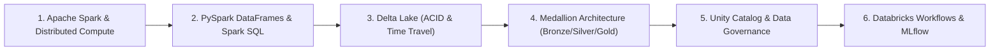

# Databricks & Apache Spark Lakehouse Curriculum

This module outlines the curriculum, architecture patterns, and hands-on projects for **Databricks**, **Apache Spark (PySpark)**, and the **Delta Lakehouse** architecture.

---

## 📚 Curriculum Roadmap

### Module 1: Distributed Computing Foundations
* **Spark Architecture**: Driver node, Cluster Manager, Worker nodes, and Executors.
* **Resilient Distributed Datasets (RDDs)**: Lineage graphs, transformations (lazy) vs. actions (eager).
* **Spark Optimization**: Catalyst Optimizer, Tungsten execution engine, Whole-Stage Code Generation.

### Module 2: PySpark & Spark SQL
* Distributed DataFrame operations (`select`, `filter`, `groupBy`, `join`).
* Handling data skew with salting, broadcast joins (`broadcast(df)`), and adaptive query execution (AQE).
* User-Defined Functions (UDFs) vs Pandas UDFs (PyArrow-backed vectorized UDFs).

### Module 3: Delta Lake & The Medallion Architecture
* **Delta Lake Storage**: Parquet data files + JSON transaction log (`_delta_log`).
* **ACID Transactions**: Concurrent reads/writes, schema enforcement, and schema evolution.
* **Time Travel & Compaction**: Querying historical states (`VERSION AS OF`), `OPTIMIZE` with `Z-ORDER BY`.
* **Medallion Architecture**:
  * **Bronze Layer (Raw Ingestion)**: Append-only raw data directly from sources.
  * **Silver Layer (Cleaned & Conformed)**: Deduplicated, enriched, filtered, and structured tables.
  * **Gold Layer (Business Aggregates)**: Star/snowflake schemas and curated metrics ready for BI and ML.

### Module 4: Enterprise Lakehouse Management
* **Unity Catalog**: Centralized access control, audit logging, data lineage, and cross-workspace discovery.
* **Databricks Workflows**: Multi-task orchestration, alerts, and CI/CD integration.
* **Delta Live Tables (DLT)**: Declarative pipeline development with automatic data quality expectations.
