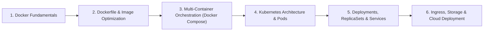

# Docker & Kubernetes Cloud-Native Curriculum

This module covers **Containerization with Docker** and **Container Orchestration with Kubernetes**, providing the foundation for modern DevOps, microservices architecture, and cloud deployment pipelines.

---

## 📚 Curriculum Roadmap

### Module 1: Containerization with Docker
* **Containers vs VMs**: Linux Kernel isolation (Namespaces: PID, NET, MNT, IPC; Cgroups: CPU, memory constraints).
* **Docker Architecture**: Docker Daemon (`dockerd`), Docker CLI, containerd, OCI runc.
* **Dockerfile Best Practices**:
  * Multi-stage builds to minimize attack surface and image size.
  * Layer caching optimization (copying `requirements.txt` before application source).
  * Running as non-root user (`USER nonroot`).
  * `.dockerignore` usage to prevent credential leakage.
* **Networking & Storage**: Bridge, Host, None networks; Anonymous vs Named Volumes vs Bind Mounts.

### Module 2: Multi-Container Applications (Docker Compose)
* Declarative service definitions with `docker-compose.yaml`.
* Defining inter-container networking, DNS service discovery, and health checks.
* Managing persistent volumes and secrets across multi-service stacks.

### Module 3: Container Orchestration with Kubernetes (K8s)
* **Cluster Architecture**:
  * Control Plane: `kube-apiserver`, `etcd`, `kube-scheduler`, `kube-controller-manager`.
  * Worker Nodes: `kubelet`, `kube-proxy`, container runtime (`containerd`).
* **Workload Resources**:
  * **Pods**: Lifecycle, multi-container patterns (Sidecar, Adapter, Ambassador).
  * **Deployments & ReplicaSets**: Rolling updates, canary releases, rollbacks (`kubectl rollout undo`).
  * **StatefulSets & DaemonSets**: Managing stateful databases and cluster-wide logging agents.
  * **Jobs & CronJobs**: Ephemeral batch execution.
* **Networking & Service Discovery**:
  * `ClusterIP`, `NodePort`, and `LoadBalancer` service types.
  * Ingress Controllers (Nginx, Traefik) and TLS termination via cert-manager.
* **Storage & Configuration**:
  * PersistentVolumes (PV), PersistentVolumeClaims (PVC), and StorageClasses.
  * ConfigMaps and Kubernetes Secrets.

---

## 📂 Repository Contents

| File | Description |
| :--- | :--- |
| [Fundamentals.txt](file:///C:/Users/PANRIT/ALL/Pranit%20Main/Study/Docker%20+%20KUBERNETES/Fundamentals.txt) | Comprehensive guide covering VMs vs Containers, Dockerfile instructions, K8s control plane, and core objects. |
| [docker_kubernetes_course.html](file:///C:/Users/PANRIT/ALL/Pranit%20Main/Study/Docker%20+%20KUBERNETES/docker_kubernetes_course.html) | Interactive full-course UI containing visual lessons, commands, and practice modules. |
