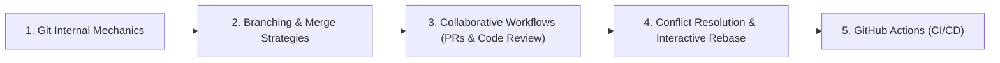

# Git & GitHub Version Control Curriculum

This module covers **Git**, **Distributed Version Control**, **GitHub collaboration workflows**, and **CI/CD automation**.

---

## 📚 Curriculum Roadmap

### Module 1: Git Plumbing & Architecture
* **The Three Trees**: Working Directory, Staging Area (Index), and Repository (Git Directory / HEAD).
* **Object Model**: Blobs (file contents), Trees (directories), Commits (metadata & root tree pointer), Tags.
* **Content-Addressable Storage**: SHA-1 / SHA-256 hash hashing.

### Module 2: Core Branching & History Operations
* Branch creation, switching (`git checkout` vs modern `git switch` and `git restore`).
* Fast-forward merges vs 3-way merges vs Squash merges.
* Rewriting history cleanly: `git commit --amend`, interactive rebase (`git rebase -i`), and `git cherry-pick`.
* Safety nets: Navigating detached HEAD and recovering lost commits via `git reflog`.

### Module 3: GitHub Collaboration & CI/CD Pipelines
* Pull Request (PR) lifecycle: drafting, branch protection rules, required approvals, and linear history.
* **GitHub Actions**: Automated testing, linting (`flake8`, `black`, `ruff`), Docker builds, and deployment workflows.
