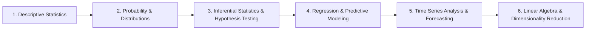

# Mathematics & Statistics for Data Science & Engineering

This repository module contains study notes, statistical curricula, and mathematical foundations for **Data Analytics**, **Machine Learning**, and **Quantitative Engineering**.

---

## 📚 Curriculum Roadmap

### Module 1: Descriptive Statistics
* **Measures of Central Tendency**:
  * Mean ($\mu$ for population, $\bar{x}$ for sample): Arithmetic average; sensitive to extreme outliers.
  * Median: 50th percentile; robust measure of center for skewed distributions.
  * Mode: Most frequent observation; suitable for categorical and discrete variables.
* **Measures of Dispersion**:
  * Variance ($\sigma^2$, $s^2$) & Standard Deviation ($\sigma$, $s$): Measure of spread around the mean.
  * Range & Interquartile Range (IQR = $Q_3 - Q_1$): Robust spread metric used in boxplot outlier thresholds ($[Q_1 - 1.5\text{IQR}, Q_3 + 1.5\text{IQR}]$).
* **Shape of Distributions**:
  * Skewness: Degree of asymmetry (Right/Positive skew: tail to right, Mean > Median; Left/Negative skew: tail to left, Mean < Median).
  * Kurtosis: Measure of tailedness and peakedness (Leptokurtic, Mesokurtic, Platykurtic).

### Module 2: Probability & Theoretical Distributions
* **Rules of Probability**: Addition rule, multiplication rule, conditional probability $P(A|B) = \frac{P(A \cap B)}{P(B)}$, Bayes' Theorem.
* **Discrete Distributions**: Bernoulli, Binomial, Poisson (modeling arrival rates).
* **Continuous Distributions**: Uniform, Normal (Gaussian $\mathcal{N}(\mu, \sigma^2)$), Standard Normal ($Z$-distribution), Student's $t$, Chi-Square ($\chi^2$), and Exponential.
* **Central Limit Theorem (CLT)**: The sampling distribution of the sample mean approaches normality as sample size $n \ge 30$, regardless of the underlying population distribution.

### Module 3: Inferential Statistics & Hypothesis Testing
* **Estimation**: Point estimates vs. Confidence Intervals (CI = $\bar{x} \pm Z^* \frac{\sigma}{\sqrt{n}}$).
* **Hypothesis Testing Framework**:
  * Formulate Null ($H_0$) and Alternative ($H_1$) hypotheses.
  * Select significance level $\alpha$ (typically 0.05).
  * Calculate Test Statistic ($Z$-test, $t$-test, ANOVA $F$-test, $\chi^2$ test of independence).
  * Compute $p$-value and interpret Type I error ($\alpha$, false positive) vs. Type II error ($\beta$, false negative).
* **A/B Testing**: Sample size determination, minimum detectable effect (MDE), power analysis ($1 - \beta$).

### Module 4: Time Series Analysis & Linear Algebra
* **Time Series Components**: Trend ($T$), Seasonality ($S$), Cyclical ($C$), and Irregular/Noise ($I$).
* **Stationarity**: Augmented Dickey-Fuller (ADF) test, differencing, moving averages.
* **Forecasting Models**: Autoregressive (AR), Moving Average (MA), ARIMA, SARIMA.
* **Linear Algebra for ML**: Vector spaces, matrix transformations, eigenvalues and eigenvectors, Principal Component Analysis (PCA) for dimensionality reduction.

---

## 📂 Repository Contents

| File | Description |
| :--- | :--- |
| [stats_topics.docx](file:///C:/Users/PANRIT/ALL/Pranit%20Main/Study/MATH/stats_topics.docx) | Comprehensive syllabus and business use cases across statistics and data science. |
| [Statistics.one](file:///C:/Users/PANRIT/ALL/Pranit%20Main/Study/MATH/Statistics.one) | Microsoft OneNote digital workbook containing handwritten/typed notes and derivations. |
| [Open Notebook.onetoc2](file:///C:/Users/PANRIT/ALL/Pranit%20Main/Study/MATH/Open%20Notebook.onetoc2) | OneNote table of contents and notebook registry. |
