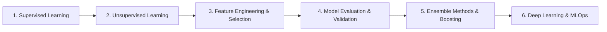

# Machine Learning & AI Engineering Curriculum

This module outlines the core theoretical foundations, classical algorithms, evaluation frameworks, and production engineering practices for **Machine Learning (ML)** and **Applied AI**.

---

## 📚 Curriculum Roadmap

### Module 1: Supervised Learning
* **Regression**:
  * Simple & Multiple Linear Regression (Ordinary Least Squares).
  * Regularization: Ridge ($L_2$), Lasso ($L_1$), and ElasticNet.
* **Classification**:
  * Logistic Regression (Sigmoid function, Log-loss).
  * K-Nearest Neighbors (KNN), Naive Bayes (conditional independence).
  * Support Vector Machines (SVM, Kernel trick: RBF, polynomial).
  * Decision Trees (Entropy, Information Gain, Gini Impurity).

### Module 2: Unsupervised Learning & Dimensionality Reduction
* **Clustering**: K-Means clustering, Elbow method, Silhouette analysis, DBSCAN, Hierarchical Clustering.
* **Dimensionality Reduction**: Principal Component Analysis (PCA), t-SNE, UMAP.
* **Anomaly Detection**: Isolation Forests, Local Outlier Factor (LOF).

### Module 3: Ensemble Methods & Advanced Modeling
* **Bagging**: Random Forests (bootstrap aggregation, out-of-bag error).
* **Boosting**: AdaBoost, Gradient Boosting, XGBoost, LightGBM, CatBoost.
* **Stacking & Voting Classifiers**.

### Module 4: Model Evaluation & Validation Techniques
* Cross-Validation: $K$-Fold, Stratified $K$-Fold, TimeSeriesSplit.
* Metrics:
  * Regression: MAE, MSE, RMSE, $R^2$, Adjusted $R^2$.
  * Classification: Confusion Matrix, Accuracy, Precision, Recall, $F_1$-score, ROC-AUC curve.
* Bias-Variance Tradeoff & learning curves.

### Module 5: Modern AI & MLOps
* Experiment tracking: MLflow, Weights & Biases.
* Model serving: FastAPI, Docker, ONNX Runtime.
