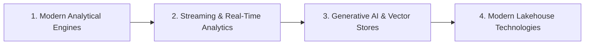

# Emerging Technologies & Modern Engineering Stack

This module tracks hands-on exploration and practical evaluation of emerging software paradigms, cutting-edge data platforms, and next-generation developer tooling.

---

## 📚 Stack Exploration Roadmap

### Key Technologies Under Study:
1. **Modern Analytical Databases & Query Engines**:
   - **DuckDB**: Embedded analytical SQL OLAP database for fast in-process analytics.
   - **ClickHouse**: Column-oriented DBMS for real-time analytical reporting at petabyte scale.
2. **Real-Time Data Streaming & Event Hubs**:
   - **Apache Kafka** / **Redpanda**: Distributed event streaming with zero-dependency C++ architecture.
3. **Generative AI & Agentic Tooling**:
   - Vector Databases: ChromaDB, Qdrant, Milvus for high-dimensional semantic search.
   - LLM Orchestration: LangChain, LlamaIndex, LiteLLM.
4. **Data Transformation & Modern Data Stack**:
   - **dbt (data build tool)**: Modular SQL transformation with automated testing and documentation.
   - **Apache Iceberg / Apache Hudi**: Open table formats for enterprise lakehouses.
