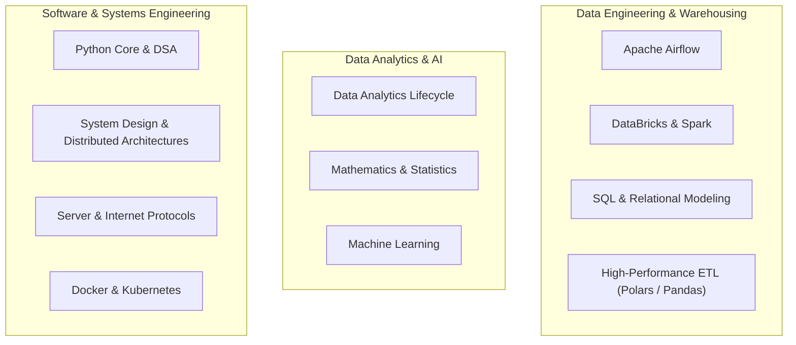

# Comprehensive Technical Study & Engineering Showcase

A structured repository documenting my journey across **Data Engineering**, **Data Analytics**, **Machine Learning**, **Software Architecture**, and **DevOps Infrastructure**.

This repository combines theoretical study notes, concept deep-dives, interactive Jupyter notebooks, automated data pipelines, and production code architectures.

---

## 🗺️ Master Curriculum Overview

---

## 📂 Repository Topic Directory

| Topic & Domain | Folder Link | Curriculum Summary |
| :--- | :--- | :--- |
| **Apache Airflow** | [Apache Airflow/](file:///C:/Users/PANRIT/ALL/Pranit%20Main/Study/Apache%20Airflow) | Orchestration fundamentals, DAG authoring, TaskFlow API, Executors, and complete Docker Compose deployment. |
| **Data Analytics** | [Data Analytics/](file:///C:/Users/PANRIT/ALL/Pranit%20Main/Study/Data%20Analytics) | End-to-end 6-step analytics lifecycle, SQL data profiling, modular automated data cleaning, and EDA engines. |
| **DataBricks** | [DataBricks/](file:///C:/Users/PANRIT/ALL/Pranit%20Main/Study/DataBricks) | PySpark distributed computing, Delta Lakehouse ACID transactions, and Medallion architecture (Bronze/Silver/Gold). |
| **Docker + Kubernetes** | [Docker + KUBERNETES/](file:///C:/Users/PANRIT/ALL/Pranit%20Main/Study/Docker%20+%20KUBERNETES) | Linux namespaces/cgroups, Dockerfile multi-stage builds, K8s control plane, Pods, Deployments, and Services. |
| **Git & Version Control** | [GitHub/](file:///C:/Users/PANRIT/ALL/Pranit%20Main/Study/GitHub) | Git plumbing/porcelain, branching strategies, interactive rebases, conflict resolution, and CI/CD actions. |
| **Mathematics & Statistics** | [MATH/](file:///C:/Users/PANRIT/ALL/Pranit%20Main/Study/MATH) | Descriptive & inferential statistics, hypothesis testing (t-test, ANOVA, $\chi^2$), probability distributions, and time series. |
| **Machine Learning** | [Machine Learning/](file:///C:/Users/PANRIT/ALL/Pranit%20Main/Study/Machine%20Learning) | Supervised/unsupervised algorithms, regularization, tree ensembles (XGBoost/LightGBM), and model evaluation metrics. |
| **New Tech Stack** | [New Tech Stack/](file:///C:/Users/PANRIT/ALL/Pranit%20Main/Study/New%20Tech%20Stack) | Modern analytical OLAP engines (DuckDB, ClickHouse), streaming platforms (Kafka/Redpanda), and Vector databases. |
| **Python Mastery & DSA** | [python/](file:///C:/Users/PANRIT/ALL/Pranit%20Main/Study/python) | 20+ DSA notebooks, CPython internals, OOP architecture, FastAPI, and hybrid ETL project using Pandas, Polars & SQL. |
| **Server & Networking** | [Server_Internet_protocols/](file:///C:/Users/PANRIT/ALL/Pranit%20Main/Study/Server_Internet_protocols) | TCP/IP model, DNS resolution, NAT & Port Forwarding, Linux server provisioning, and Tailscale mesh VPN security. |
| **Structured Query Language** | [SQL/](file:///C:/Users/PANRIT/ALL/Pranit%20Main/Study/SQL) | DDL/DML, index internals, relational joins, subqueries, CTEs, and advanced window functions. |
| **System Design** | [System Design/](file:///C:/Users/PANRIT/ALL/Pranit%20Main/Study/System%20Design) | Horizontal vs vertical scaling, load balancing, caching strategies, CAP theorem (PACELC), and message queues. |

---

## 🛠️ Key Featured Implementations

### 1. [Hybrid High-Performance ETL Engine](file:///C:/Users/PANRIT/ALL/Pranit%20Main/Study/python/Pandas_Polars_Numpy/PROJECT)
* Integrates **Pandas** for resilient database ingestion with **Polars** for multi-threaded columnar transformations.
* Connects directly to MS SQL Server with automated fallback to local sample data.
* Exports clean datasets into Snappy-compressed Apache Parquet format.

### 2. [Automated Data Cleaning & Quality Engine](file:///C:/Users/PANRIT/ALL/Pranit%20Main/Study/Data%20Analytics/2_Data_Transformation/2_data_cleaning/auto_cleaning.py)
* Reusable OOP engine that inspects column data types, computes skewness to selectively impute numerical features (mean vs interpolation), forward-fills time series, and mode-imputes categorical fields.

### 3. [Exploratory Data Analysis (EDA) Engine](file:///C:/Users/PANRIT/ALL/Pranit%20Main/Study/Data%20Analytics/2_Data_Transformation/3_EDA/_EDA_.py)
* Class-based analytical framework providing skewness assessment, statistical outlier detection via both $Z$-Score and Interquartile Range (IQR), and correlation matrix generation.

### 4. [Dockerized Apache Airflow Environment](file:///C:/Users/PANRIT/ALL/Pranit%20Main/Study/Apache%20Airflow/airflow_project)
* Production-ready local development stack with PostgreSQL metadata store, Redis broker, Webserver, Scheduler, and worker nodes.

---

## 📌 Repository Purpose & Maintenance
This repository serves as a permanent, actively maintained technical reference and showcase for engineering best practices, code clarity, and architectural understanding. All scripts and notebooks are designed to be reproducible, modular, and well-documented.
