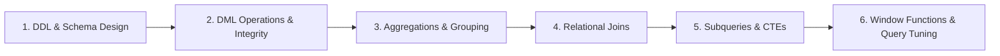

# Structured Query Language (SQL) Mastery

This module contains practical SQL scripts, data modeling principles, and conceptual references covering **Relational Database Management Systems (RDBMS)**, from basic schema design to advanced analytical window functions.

---

## 📚 Curriculum Roadmap

### Module 1: DDL & Database Design
* **Database & Table Creation**: Primary keys, auto-increment sequences, foreign keys, not-null, check constraints.
* **Schema Evolution**: Modifying schemas using `ALTER TABLE`, dropping columns, managing data types (`VARCHAR`, `INT`, `FLOAT`, `DATETIME`).
* **Relational Normalization**: 1NF, 2NF, 3NF, and Boyce-Codd Normal Form (BCNF).

### Module 2: Data Manipulation (DML) & Transactions
* **Data Mutation**: `INSERT INTO`, batch inserts, `UPDATE ... WHERE`, conditional `DELETE`.
* **Safe Deletions vs Truncations**: `DELETE` (logged, row-by-row, triggers active) vs `TRUNCATE` (DDL deallocation, resets identity).
* **ACID Transactions**: Atomicity, Consistency, Isolation levels (Read Uncommitted, Read Committed, Repeatable Read, Serializable), and Durability.

### Module 3: Joins, Aggregations & Grouping
* **Join Mechanics**:
  * `INNER JOIN`: Intersecting records matching key conditions.
  * `LEFT OUTER JOIN` / `RIGHT OUTER JOIN`: Preserving unmatched rows from left/right side.
  * `FULL OUTER JOIN`: Complete union of matched and unmatched records.
  * `CROSS JOIN`: Cartesian product.
* **Aggregations**: `COUNT()`, `SUM()`, `AVG()`, `MIN()`, `MAX()`.
* **Filtering vs Group Filtering**: Understanding `WHERE` (pre-aggregation row filter) vs `HAVING` (post-aggregation group filter).

### Module 4: Advanced Querying & Analytical Window Functions
* **Subqueries & CTEs**: Scalar subqueries, correlated subqueries, Common Table Expressions (`WITH` clauses).
* **Duplicate Elimination**: Identifying and purging duplicates using `ROW_NUMBER() OVER (PARTITION BY ... ORDER BY ...)`.
* **Analytical Window Functions**:
  * Ranking: `ROW_NUMBER()`, `RANK()`, `DENSE_RANK()`, `NTILE()`.
  * Navigation / Value: `LAG()`, `LEAD()`, `FIRST_VALUE()`, `LAST_VALUE()`.
  * Running Totals & Moving Averages: `SUM(...) OVER (PARTITION BY ... ORDER BY ... ROWS BETWEEN ...)`.

---

## 📂 Repository Contents

| File | Description |
| :--- | :--- |
| [Basics.txt](file:///C:/Users/PANRIT/ALL/Pranit%20Main/Study/SQL/Basics.txt) | Overview of SQL sublanguages (DDL, DML, DQL, DCL, TCL), constraint types, and execution order. |
| [basic_language.sql](file:///C:/Users/PANRIT/ALL/Pranit%20Main/Study/SQL/basic_language.sql) | Practical SQL scripts for table creation, schema alterations, CRUD operations, subqueries, and duplicate management. |
| [next_level.sql](file:///C:/Users/PANRIT/ALL/Pranit%20Main/Study/SQL/next_level.sql) | Intermediate and advanced SQL queries covering Inner/Outer Joins, Aggregations, HAVING clauses, and Window Functions. |
