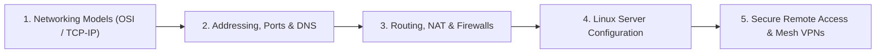

# Server Administration & Internet Protocols

This repository module contains study notes, architecture diagrams, and deployment guides covering **Computer Networking**, **Internet Protocols**, and **Linux Server Administration**.

---

## 📚 Curriculum Roadmap

### Module 1: Network Layers & Protocols
* **TCP/IP vs. OSI Model**: Encapsulation, decapsulation, packet headers, and layer responsibilities.
* **TCP vs. UDP**:
  * TCP: Connection-oriented, 3-way handshake (`SYN` $\to$ `SYN-ACK` $\to$ `ACK`), flow control, congestion control, and guaranteed delivery.
  * UDP: Connectionless, lightweight, low-latency streaming and gaming.
* **Application Protocols**: HTTP/HTTPS (TLS 1.3 handshakes, certificates), SSH, FTP, SMTP, and WebSockets.

### Module 2: Name Resolution & Traffic Routing
* **Domain Name System (DNS)**: Hierarchical lookup flow (Root $\to$ TLD $\to$ Authoritative), DNS records (`A`, `AAAA`, `CNAME`, `MX`, `TXT`), caching, and TTL.
* **IP Addressing & Subnetting**: IPv4 vs IPv6, CIDR notation, private IP ranges (RFC 1918: `10.0.0.0/8`, `172.16.0.0/12`, `192.168.0.0/16`).
* **NAT (Network Address Translation)**: SNAT, DNAT, Port Address Translation (PAT), and NAT port forwarding.
* **Firewalls & Network Security**: Packet filtering, stateful inspection, `ufw` / `iptables`, and security group policies.

### Module 3: Linux Server Administration & Secure Access
* **Bare-Metal & VM Provisioning**: Ubuntu Server installation, disk partitioning, headless operation.
* **Package & Service Management**: `systemd` daemon management (`systemctl status/start/enable`), logs via `journalctl`.
* **Hardening & SSH**: Public-key authentication (`ssh-keygen`, `authorized_keys`), disabling root password login.
* **Mesh VPNs & Zero-Trust Networking**: Setting up WireGuard and Tailscale for point-to-point encrypted tunnels without exposing public ports.

---

## 📂 Repository Contents

| File | Description |
| :--- | :--- |
| [Fundametals.txt](file:///C:/Users/PANRIT/ALL/Pranit%20Main/Study/Server_Internet_protocols/Fundametals.txt) | Core concepts of TCP/IP, Ports & Protocols, DNS resolution, NAT translation, and Firewalls. |
| [Settingup_linux.txt](file:///C:/Users/PANRIT/ALL/Pranit%20Main/Study/Server_Internet_protocols/Settingup_linux.txt) | Step-by-step procedure for installing Ubuntu Server, configuring SSH, and securing with Tailscale mesh VPN. |
