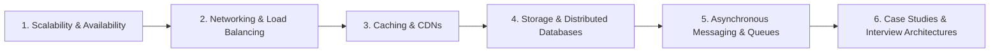

# System Design & Distributed Systems

This module covers large-scale **System Design**, **Distributed Systems Architecture**, and **High-Availability Engineering** principles.

---

## 📚 Curriculum Roadmap

### Module 1: Scalability & Performance Metrics
* **Vertical vs Horizontal Scaling**: Trade-offs, hardware bottlenecks, cluster coordination.
* **Latency vs Throughput**: Definitions, percentile metrics ($p50$, $p90$, $p99$, $p99.9$), Little's Law.
* **Availability & Reliability**: Designing for Nine Nines (99.999%), High Availability (HA) architectures, fault domain isolation.

### Module 2: Load Balancing & Proxies
* Reverse Proxies vs Forward Proxies (Nginx, HAProxy, Envoy).
* Layer 4 vs Layer 7 load balancing.
* Balancing algorithms: Round Robin, Weighted, Least Connections, Consistent Hashing (virtual nodes).

### Module 3: Caching & Content Delivery
* **In-Memory Caching**: Redis vs Memcached data structures and cluster modes.
* **Cache Patterns**: Cache-aside, Read-through, Write-through, Write-behind.
* **Cache Invalidation & Pitfalls**: Cache Stampede (Thundering Herd), Cache Penetration, Cache Breakdown.
* **CDNs (Content Delivery Networks)**: Edge caching, static asset distribution, Anycast routing.

### Module 4: Database Strategies & Distributed Consensus
* **Relational (SQL) vs NoSQL**: ACID transactions vs BASE model.
* **Distributed Theorems**: CAP Theorem and PACELC trade-offs.
* **Scaling Relational DBs**: Read replicas, Connection pooling, Sharding strategies (Consistent Hashing).
* **Distributed Transactions**: Two-Phase Commit (2PC) vs Saga Pattern (Orchestration vs Choreography).

### Module 5: Asynchronous Systems & Event-Driven Architecture
* **Message Queues vs Event Streams**: RabbitMQ (AMQP) vs Apache Kafka (commit log, consumer groups, partition ordering).
* **Delivery Semantics**: At-most-once, At-least-once, Exactly-once processing.
* **Batch Processing vs Stream Processing**: Lambda vs Kappa architectures.

---

## 📂 Repository Contents

| File | Description |
| :--- | :--- |
| [Fundamentals.txt](file:///C:/Users/PANRIT/ALL/Pranit%20Main/Study/System%20Design/Fundamentals.txt) | Core system design principles: Scaling, Load Balancing, Caching, CAP theorem, Sharding, and Messaging. |
