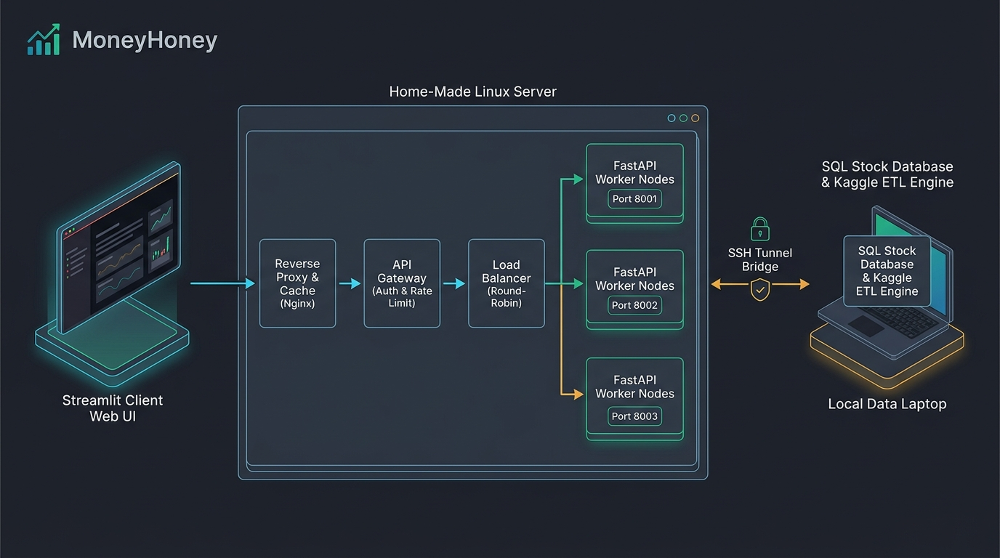

# 🍯 MoneyHoney

A production-ready FastAPI and Streamlit financial analytics and trading platform.

## Architecture



```
Client (Streamlit UI) 
  ↓ (HTTP / Port 80)
Reverse Proxy & Cache (Nginx)
  ↓ (Internal Forward)
API Gateway (Rate Limiting & Auth)
  ↓ (Internal Forward)
Load Balancer (Nginx Upstream Round-Robin)
  ↓ (Ports 8001, 8002, 8003)
FastAPI Application Cluster
  ↓ (Encrypted SSH Tunnel: Port 1433)
SQL Stock Database (Laptop SSMS / PostgreSQL)
```

## Directory Structure

```text
MoneyHoney/
├── backend/                         # FastAPI REST Microservice
│   ├── Dockerfile
│   ├── requirements.txt
│   └── app/
│       ├── main.py                  # FastAPI Application Entrypoint
│       ├── core/                    # Config, Security, Logger
│       ├── db/                      # Session & Base declarative
│       ├── models/                  # SQLAlchemy ORM Models (stock, watchlist, trade, analysis)
│       ├── schemas/                 # Pydantic Schemas
│       ├── crud/                    # Business & Database Logic
│       └── api/v1/endpoints/        # Route Controllers
│
├── frontend/                        # Streamlit Multi-page App
│   ├── Dockerfile
│   ├── requirements.txt
│   ├── main.py                      # App Entrypoint & Navigation
│   ├── client/api_client.py         # HTTP Gateway Client
│   ├── components/                  # Reusable UI widgets
│   └── pages/                       # Multi-page views (Market Data, Watchlist, Trades, Analysis)
│
├── deploy/                          # Infrastructure & Deployment
│   ├── nginx/                       # Nginx Cache & Upstream LB configurations
│   ├── systemd/                     # AutoSSH tunnel & backend daemon services
│   └── scripts/                     # Helper launch scripts
│
├── etl/                             # Data Ingestion
│   ├── setup.py                     # Kaggle data download & SQL upload
│   └── sync_stocks.py               # Periodic stock data refresh
│
├── .env.example
├── .gitignore
├── docker-compose.yml
└── architecture_diagram.png
```
