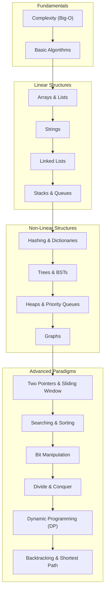

# Data Structures & Algorithms (DSA) in Python

A structured repository of **20+ interactive notebooks** implementing essential data structures, classical algorithms, and interview problem-solving patterns in Python.

---

## 📚 Curriculum Roadmap

---

## 📂 Topic Index & Notebooks

| Topic | Notebook / File | Key Concepts & Patterns |
| :--- | :--- | :--- |
| **Foundations** | [Fundamentals.txt](file:///C:/Users/PANRIT/ALL/Pranit%20Main/Study/python/DSA/Fundamentals.txt) | Big-O, $\Omega$, $\Theta$ asymptotic complexity, time/space trade-offs. |
| **Basics** | [basic.ipynb](file:///C:/Users/PANRIT/ALL/Pranit%20Main/Study/python/DSA/basic.ipynb) | Iteration patterns, recursion basics, frequency counting. |
| **Arrays & Lists** | [Arrays_List.ipynb](file:///C:/Users/PANRIT/ALL/Pranit%20Main/Study/python/DSA/Arrays_List.ipynb) | Dynamic arrays, in-place rotations, prefix sums, kadane's algorithm. |
| **Strings** | [Strings.ipynb](file:///C:/Users/PANRIT/ALL/Pranit%20Main/Study/python/DSA/Strings.ipynb) | Anagrams, palindromes, substring searches, string hashing. |
| **Two Pointers** | [Two_Pointers.ipynb](file:///C:/Users/PANRIT/ALL/Pranit%20Main/Study/python/DSA/Two_Pointers.ipynb) | Opposite-end pointers, fast & slow runner (cycle detection). |
| **Sliding Window** | [Sliding_window.ipynb](file:///C:/Users/PANRIT/ALL/Pranit%20Main/Study/python/DSA/Sliding_window.ipynb) | Fixed-size and dynamic-size window optimization problems. |
| **Linked Lists** | [Linked_list.ipynb](file:///C:/Users/PANRIT/ALL/Pranit%20Main/Study/python/DSA/Linked_list.ipynb) | Singly/doubly linked lists, node reversals, merging sorted lists. |
| **Stack** | [Stack.ipynb](file:///C:/Users/PANRIT/ALL/Pranit%20Main/Study/python/DSA/Stack.ipynb) | Monotonic stacks, valid parentheses, expression evaluation. |
| **Queue & Deque** | [Queue_dequeue.ipynb](file:///C:/Users/PANRIT/ALL/Pranit%20Main/Study/python/DSA/Queue_dequeue.ipynb) | FIFO queues, double-ended queues, circular buffers. |
| **Hashing** | [Hashing_Dict.ipynb](file:///C:/Users/PANRIT/ALL/Pranit%20Main/Study/python/DSA/Hashing_Dict.ipynb) | Hash maps, collision resolution, constant time lookups. |
| **Sets** | [Sets.ipynb](file:///C:/Users/PANRIT/ALL/Pranit%20Main/Study/python/DSA/Sets.ipynb) | Set operations, unique element tracking, disjoint sets. |
| **Trees** | [Trees.ipynb](file:///C:/Users/PANRIT/ALL/Pranit%20Main/Study/python/DSA/Trees.ipynb) | DFS/BFS traversals (Inorder, Preorder, Postorder, Level-order), BSTs. |
| **Heaps** | [Heap.ipynb](file:///C:/Users/PANRIT/ALL/Pranit%20Main/Study/python/DSA/Heap.ipynb) | Min-heaps, Max-heaps, `heapq` module, finding $k$-th largest elements. |
| **Graphs** | [Graphs.ipynb](file:///C:/Users/PANRIT/ALL/Pranit%20Main/Study/python/DSA/Graphs.ipynb) | Adjacency list/matrix, BFS, DFS, cycle detection, topological sort. |
| **Shortest Path** | [Shortest_Path_Algo.ipynb](file:///C:/Users/PANRIT/ALL/Pranit%20Main/Study/python/DSA/Shortest_Path_Algo.ipynb) | Dijkstra's algorithm, Bellman-Ford, Floyd-Warshall. |
| **Searching** | [Searching.ipynb](file:///C:/Users/PANRIT/ALL/Pranit%20Main/Study/python/DSA/Searching.ipynb) | Linear search, Binary search, search in rotated sorted arrays. |
| **Sorting** | [Sorting.ipynb](file:///C:/Users/PANRIT/ALL/Pranit%20Main/Study/python/DSA/Sorting.ipynb) | Bubble, Selection, Insertion, Merge Sort, Quick Sort. |
| **Bit Manipulation**| [Bit_manupilation.ipynb](file:///C:/Users/PANRIT/ALL/Pranit%20Main/Study/python/DSA/Bit_manupilation.ipynb) | Bitwise AND, OR, XOR, bit masking, single number identification. |
| **Divide & Conquer**| [Divide_Conqure.ipynb](file:///C:/Users/PANRIT/ALL/Pranit%20Main/Study/python/DSA/Divide_Conqure.ipynb) | Subproblem recurrence, master theorem, binary exponentiation. |
| **Dynamic Prog.** | [Dynamic_Programming.ipynb](file:///C:/Users/PANRIT/ALL/Pranit%20Main/Study/python/DSA/Dynamic_Programming.ipynb) | Memoization (Top-down) vs Tabulation (Bottom-up), Knapsack problem. |
| **Backtracking** | [back_tracking.ipynb](file:///C:/Users/PANRIT/ALL/Pranit%20Main/Study/python/DSA/back_tracking.ipynb) | State-space trees, N-Queens, Sudoku solver, subsets/permutations. |
