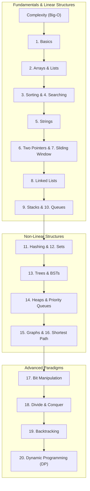

# Data Structures & Algorithms (DSA) in Python

A structured repository of **20+ interactive notebooks** implementing essential data structures, classical algorithms, and interview problem-solving patterns in Python.

---

## 📚 Curriculum Roadmap

```mermaid
flowchart TD
    subgraph Fundamentals & Linear Structures
        A["Complexity (Big-O)"] --> B["1. Basics"]
        B --> C["2. Arrays & Lists"]
        C --> D["3. Sorting & 4. Searching"]
        D --> E["5. Strings"]
        E --> F["6. Two Pointers & 7. Sliding Window"]
        F --> G["8. Linked Lists"]
        G --> H["9. Stacks & 10. Queues"]
    end
    subgraph Non-Linear Structures
        H --> I["11. Hashing & 12. Sets"]
        I --> J["13. Trees & BSTs"]
        J --> K["14. Heaps & Priority Queues"]
        K --> L["15. Graphs & 16. Shortest Path"]
    end
    subgraph Advanced Paradigms
        L --> M["17. Bit Manipulation"]
        M --> N["18. Divide & Conquer"]
        N --> O["19. Backtracking"]
        O --> P["20. Dynamic Programming (DP)"]
    end
```

---

## 📂 Topic Index & Notebooks

| Topic | Notebook / File | Key Concepts & Patterns |
| :--- | :--- | :--- |
| **Foundations** | [Fundamentals.txt](file:///C:/Users/PANRIT/ALL/Pranit%20Main/Study/python/DSA/Fundamentals.txt) | Big-O, $\Omega$, $\Theta$ asymptotic complexity, time/space trade-offs. |
| **1. Basics** | [1_basic.ipynb](file:///C:/Users/PANRIT/ALL/Pranit%20Main/Study/python/DSA/1_basic.ipynb) | Iteration patterns, recursion basics, frequency counting. |
| **2. Arrays & Lists** | [2_Arrays_List.ipynb](file:///C:/Users/PANRIT/ALL/Pranit%20Main/Study/python/DSA/2_Arrays_List.ipynb) | Dynamic arrays, in-place rotations, prefix sums, kadane's algorithm. |
| **3. Sorting** | [3_Sorting.ipynb](file:///C:/Users/PANRIT/ALL/Pranit%20Main/Study/python/DSA/3_Sorting.ipynb) | Bubble, Selection, Insertion, Merge Sort, Quick Sort. |
| **4. Searching** | [4_Searching.ipynb](file:///C:/Users/PANRIT/ALL/Pranit%20Main/Study/python/DSA/4_Searching.ipynb) | Linear search, Binary search, search in rotated sorted arrays. |
| **5. Strings** | [5_Strings.ipynb](file:///C:/Users/PANRIT/ALL/Pranit%20Main/Study/python/DSA/5_Strings.ipynb) | Anagrams, palindromes, substring searches, string hashing. |
| **6. Two Pointers** | [6_Two_Pointers.ipynb](file:///C:/Users/PANRIT/ALL/Pranit%20Main/Study/python/DSA/6_Two_Pointers.ipynb) | Opposite-end pointers, fast & slow runner (cycle detection). |
| **7. Sliding Window** | [7_Sliding_window.ipynb](file:///C:/Users/PANRIT/ALL/Pranit%20Main/Study/python/DSA/7_Sliding_window.ipynb) | Fixed-size and dynamic-size window optimization problems. |
| **8. Linked Lists** | [8_Linked_list.ipynb](file:///C:/Users/PANRIT/ALL/Pranit%20Main/Study/python/DSA/8_Linked_list.ipynb) | Singly/doubly linked lists, node reversals, merging sorted lists. |
| **9. Stack** | [9_Stack.ipynb](file:///C:/Users/PANRIT/ALL/Pranit%20Main/Study/python/DSA/9_Stack.ipynb) | Monotonic stacks, valid parentheses, expression evaluation. |
| **10. Queue & Deque** | [10_Queue_dequeue.ipynb](file:///C:/Users/PANRIT/ALL/Pranit%20Main/Study/python/DSA/10_Queue_dequeue.ipynb) | FIFO queues, double-ended queues, circular buffers. |
| **11. Hashing** | [11_Hashing_Dict.ipynb](file:///C:/Users/PANRIT/ALL/Pranit%20Main/Study/python/DSA/11_Hashing_Dict.ipynb) | Hash maps, collision resolution, constant time lookups. |
| **12. Sets** | [12_Sets.ipynb](file:///C:/Users/PANRIT/ALL/Pranit%20Main/Study/python/DSA/12_Sets.ipynb) | Set operations, unique element tracking, disjoint sets. |
| **13. Trees** | [13_Trees.ipynb](file:///C:/Users/PANRIT/ALL/Pranit%20Main/Study/python/DSA/13_Trees.ipynb) | DFS/BFS traversals (Inorder, Preorder, Postorder, Level-order), BSTs. |
| **14. Heaps** | [14_Heap.ipynb](file:///C:/Users/PANRIT/ALL/Pranit%20Main/Study/python/DSA/14_Heap.ipynb) | Min-heaps, Max-heaps, `heapq` module, finding $k$-th largest elements. |
| **15. Graphs** | [15_Graphs.ipynb](file:///C:/Users/PANRIT/ALL/Pranit%20Main/Study/python/DSA/15_Graphs.ipynb) | Adjacency list/matrix, BFS, DFS, cycle detection, topological sort. |
| **16. Shortest Path** | [16_Shortest_Path_Algo.ipynb](file:///C:/Users/PANRIT/ALL/Pranit%20Main/Study/python/DSA/16_Shortest_Path_Algo.ipynb) | Dijkstra's algorithm, Bellman-Ford, Floyd-Warshall. |
| **17. Bit Manipulation**| [17_Bit_manupilation.ipynb](file:///C:/Users/PANRIT/ALL/Pranit%20Main/Study/python/DSA/17_Bit_manupilation.ipynb) | Bitwise AND, OR, XOR, bit masking, single number identification. |
| **18. Divide & Conquer**| [18_Divide_Conqure.ipynb](file:///C:/Users/PANRIT/ALL/Pranit%20Main/Study/python/DSA/18_Divide_Conqure.ipynb) | Subproblem recurrence, master theorem, binary exponentiation. |
| **19. Backtracking** | [19_back_tracking.ipynb](file:///C:/Users/PANRIT/ALL/Pranit%20Main/Study/python/DSA/19_back_tracking.ipynb) | State-space trees, N-Queens, Sudoku solver, subsets/permutations. |
| **20. Dynamic Prog.** | [20_Dynamic_Programming.ipynb](file:///C:/Users/PANRIT/ALL/Pranit%20Main/Study/python/DSA/20_Dynamic_Programming.ipynb) | Memoization (Top-down) vs Tabulation (Bottom-up), Knapsack problem. |

