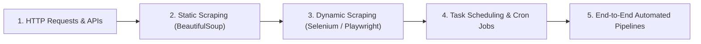

# Python Automation & Web Scraping

This module contains practical automation scripts, web scrapers, and task scheduling pipelines in Python.

---

## 📚 Curriculum Roadmap

### Key Topics
1. **Static HTML Scraping**: Using `requests` and `BeautifulSoup4` for parsing DOM hierarchies and extracting tabular data.
2. **Dynamic Headless Browsers**: Automating JavaScript-heavy single-page applications with `Selenium` and `Playwright`.
3. **Task Scheduling**: Orchestrating recurring periodic jobs with the Python `schedule` library and OS cron triggers.
4. **Data Export**: Serializing extracted information into Polars/Pandas DataFrames and saving to CSV or SQL.

---

## 📂 Contents
* [Scheduling/](file:///C:/Users/PANRIT/ALL/Pranit%20Main/Study/python/Python_Automation/Scheduling): Automated scheduling scripts and [mini_project.py](file:///C:/Users/PANRIT/ALL/Pranit%20Main/Study/python/Python_Automation/Scheduling/mini_project.py) web scraper.
* [Web-Scrapping/](file:///C:/Users/PANRIT/ALL/Pranit%20Main/Study/python/Python_Automation/Web-Scrapping): Web scraping notes in [Fundamentals.txt](file:///C:/Users/PANRIT/ALL/Pranit%20Main/Study/python/Python_Automation/Web-Scrapping/Fundamentals.txt) and interactive exercises in [web_scrapping.ipynb](file:///C:/Users/PANRIT/ALL/Pranit%20Main/Study/python/Python_Automation/Web-Scrapping/web_scrapping.ipynb).
