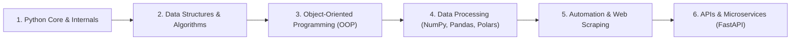

# Python Engineering & Applied Computing

A comprehensive curriculum, code laboratory, and engineering reference covering **Python programming**, from core syntax and internal runtime mechanics to advanced Data Structures, Object-Oriented Design, High-Performance Analytics (NumPy, Pandas, Polars), and Automation.

---

## 📚 Curriculum Roadmap

### 1. [Python Fundamentals & Internals](file:///C:/Users/PANRIT/ALL/Pranit%20Main/Study/python/FUNDAMENTALS.txt)
* CPython runtime architecture: Lexing $\to$ Parsing $\to$ AST $\to$ Bytecode $\to$ Python Virtual Machine (PVM).
* Dynamic typing, memory management, garbage collection (reference counting & generational cycle detector).
* Bytecode caching with `__pycache__`.

### 2. [Basics & Control Structures](file:///C:/Users/PANRIT/ALL/Pranit%20Main/Study/python/Basics)
* Primitive and collection data types: integers, floats, booleans, strings, lists, tuples, sets, dictionaries.
* Control flow: conditionals, pattern matching, `while` / `for` loops, comprehensions.

### 3. [Data Structures & Algorithms (DSA)](file:///C:/Users/PANRIT/ALL/Pranit%20Main/Study/python/DSA)
* Asymptotic time and space complexity ($\mathcal{O}$, $\Omega$, $\Theta$).
* Linear structures: Arrays, Strings, Linked Lists, Stacks, Queues.
* Non-linear structures: Trees, Binary Search Trees, Heaps, Graphs.
* Algorithmic paradigms: Two Pointers, Sliding Window, Divide & Conquer, Dynamic Programming, Backtracking, Shortest Path.

### 4. [Object-Oriented Programming (OOP)](file:///C:/Users/PANRIT/ALL/Pranit%20Main/Study/python/OOPS)
* The 4 pillars: Abstraction, Encapsulation, Inheritance, Polymorphism.
* Method paradigms: Instance methods, `@classmethod`, `@staticmethod`, `@property`.
* Advanced mechanics: Dunder methods, operator overloading, multiple inheritance (MRO).

### 5. [High-Performance Data Processing & Engineering](file:///C:/Users/PANRIT/ALL/Pranit%20Main/Study/python/Pandas_Polars_Numpy)
* **NumPy**: Vectorized array operations, broadcasting, memory layouts.
* **Pandas**: Tabular data manipulation, time series, grouping, aggregation.
* **Polars**: Multi-threaded, Rust-powered query planning with Apache Arrow memory model.
* **Production Project**: End-to-end hybrid ETL pipeline with MS SQL Server and Parquet.

### 6. [Automation & Web Scraping](file:///C:/Users/PANRIT/ALL/Pranit%20Main/Study/python/Python_Automation)
* HTML parsing with BeautifulSoup4.
* Dynamic interaction with Selenium and Playwright.
* Task scheduling with `schedule` and cron triggers.

---

## 📂 Subdirectories & Modules

| Module | Description |
| :--- | :--- |
| [Basics/](file:///C:/Users/PANRIT/ALL/Pranit%20Main/Study/python/Basics) | Fundamental data types, conditionals, and looping structures. |
| [DSA/](file:///C:/Users/PANRIT/ALL/Pranit%20Main/Study/python/DSA) | 20+ comprehensive notebooks covering data structures and interview algorithms. |
| [OOPS/](file:///C:/Users/PANRIT/ALL/Pranit%20Main/Study/python/OOPS) | Deep dive into object-oriented architecture, magic methods, and interview Q&A. |
| [Pandas_Polars_Numpy/](file:///C:/Users/PANRIT/ALL/Pranit%20Main/Study/python/Pandas_Polars_Numpy) | High-performance data wrangling engines and a complete production ETL project. |
| [Python_Automation/](file:///C:/Users/PANRIT/ALL/Pranit%20Main/Study/python/Python_Automation) | Automated scrapers and task scheduling scripts. |
| [API/](file:///C:/Users/PANRIT/ALL/Pranit%20Main/Study/python/API) | RESTful API design with FastAPI, Starlette, and Pydantic schemas. |
| [IO files/](file:///C:/Users/PANRIT/ALL/Pranit%20Main/Study/python/IO%20files) | File format comparisons (Parquet, CSV, Excel, JSON) and database connectors. |
| [Other/Logging/](file:///C:/Users/PANRIT/ALL/Pranit%20Main/Study/python/Other/Logging) | Production logging strategies, log levels, formatting, and rotation. |
| [Test/Phase - 1/](file:///C:/Users/PANRIT/ALL/Pranit%20Main/Study/python/Test/Phase%20-%201) | Skill evaluation notebook and practical interview questions. |
